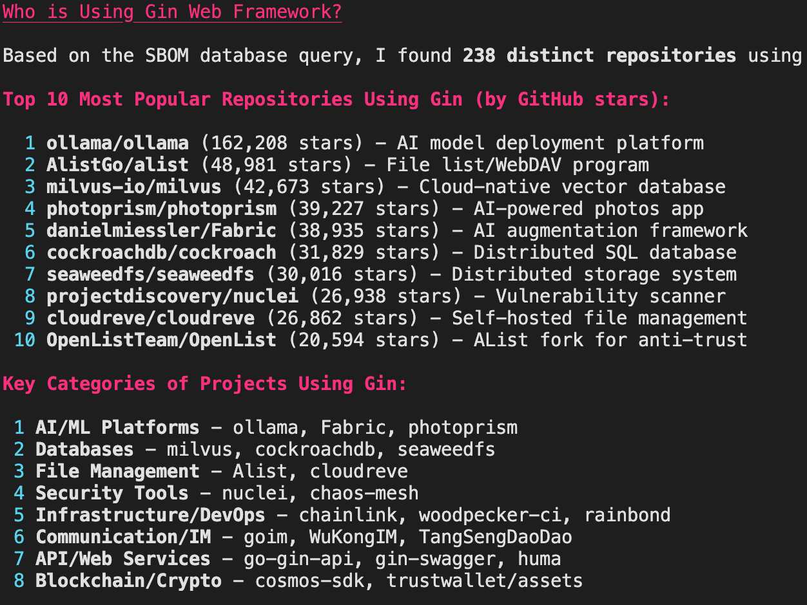
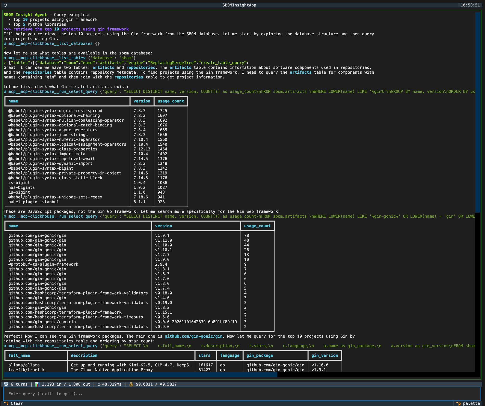
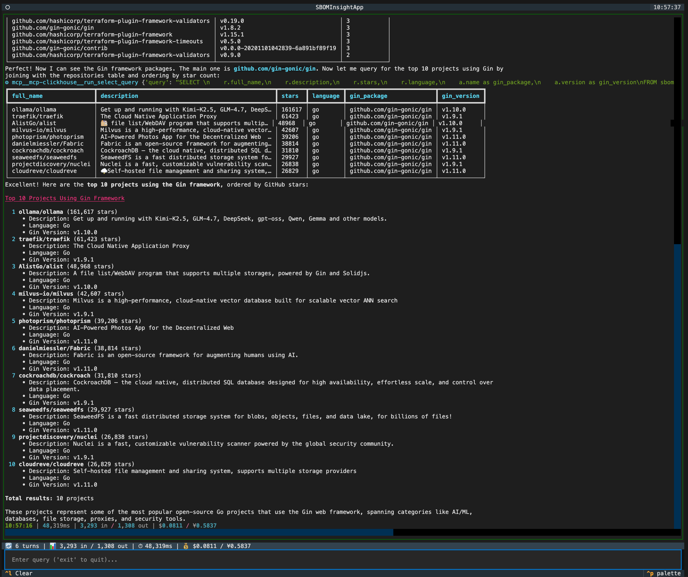

<h1 align="center">ChatSBOM</h1>

<p align="center">
  <strong>Talk to your Supply Chain. Chat with SBOMs.</strong>
</p>


ChatSBOM is a CLI tool for indexing and querying Software Bill of Materials (SBOM) data, providing deep insights into project dependencies.

<p align="center">
  
</p>

<p align="center">
  
</p>

## Why ChatSBOM?

Standard tools like GitHub Dependency Graph don't allow sorting dependents by popularity (stars) ([isaacs/github#1537](https://github.com/isaacs/github/issues/1537)). ChatSBOM solves this by collecting, indexing, and enabling natural language queries over SBOM data.

## Features

- **Discover**: Find high-quality repositories on GitHub by stars and language.
- **Collect**: Enrich metadata and fetch dependency files (`go.mod`, `package.json`, etc.).
- **Generate**: Transform files into standard SBOM format using [Syft](https://github.com/anchore/syft).
- **Index**: Load SBOM data into [ClickHouse](https://clickhouse.com/) for high-performance queries.
- **Query**: Use the CLI for stats/searches or AI-powered natural language chat.

## Getting Started

### 1. Prerequisites

- [Docker](https://www.docker.com/) (for ClickHouse)
- [Syft](https://github.com/anchore/syft) (for SBOM generation)
- [uv](https://github.com/astral-sh/uv) (for AI-powered chat feature)

### 2. Installation

```bash
# Via pip
pip install chatsbom

# Via pipx
pipx install chatsbom

# Or run directly via uvx
uvx chatsbom
```

### 3. Setup

#### Start Database

Option 1: Using docker compose

```bash
docker compose up -d
```

Option 2: Using docker run

```bash
docker run -d --name clickhouse -p 8123:8123 --ulimit nofile=262144:262144 clickhouse/clickhouse-server:25.12-alpine
docker exec clickhouse clickhouse-client -q "CREATE DATABASE IF NOT EXISTS chatsbom"
docker exec clickhouse clickhouse-client -q "CREATE USER IF NOT EXISTS admin IDENTIFIED BY 'admin'"
docker exec clickhouse clickhouse-client -q "GRANT ALL ON *.* TO admin WITH GRANT OPTION"
docker exec clickhouse clickhouse-client -q "CREATE USER IF NOT EXISTS guest IDENTIFIED BY 'guest'"
docker exec clickhouse clickhouse-client -q "GRANT SELECT ON chatsbom.* TO guest"
docker exec clickhouse clickhouse-client -q "ALTER USER guest SET PROFILE readonly"
```

#### Configure Environment: Set your API keys

```bash
export GITHUB_TOKEN="your_github_token"
export ANTHROPIC_AUTH_TOKEN="your_anthropic_token"
```

### 4. Basic Workflow

```bash
# 1. Search and collect data
chatsbom github search --language go --min-stars 10000
chatsbom github repo --language go
chatsbom github release --language go
chatsbom github commit --language go
chatsbom github content --language go

# 2. Generate and index SBOMs
chatsbom sbom generate --language go
chatsbom db index --language go

# 3. Query insights
chatsbom db status
chatsbom db query gin
chatsbom chat
```

## Use Case: Analyzing Framework Adoption

Find the most popular projects depending on a specific library (e.g., `gin`) using natural language.

<p align="center">
  
</p>

<p align="center">
  
</p>
