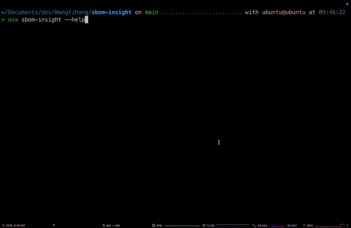

# SBOM Insight



**SBOM Insight** CLI tool for deep insights into Software Bill of Materials (SBOM) data.

## Key Features

- **Search**: Find high-quality repos on GitHub (stars/language).
- **Download**: Fetch SBOM files (`go.mod`, `pom.xml`, etc.).
- **Import**: Load metadata into ClickHouse.
- **Query**: Analyze library usage and framework stats.
- **Agent**: AI-powered TUI for natural language queries.

## Quick Start

### Prerequisites

- [uv](https://github.com/astral-sh/uv)
- [syft](https://github.com/anchore/syft)
- [docker](https://github.com/docker/docker)
- [docker-compose](https://github.com/docker/compose)
- [clickhouse](https://github.com/ClickHouse/ClickHouse)

### Installation

```bash
# Start infrastructure (ClickHouse)
docker compose up -d
```

### Usage

Run commands directly with `uvx`:

```bash
# 1. Search Github (e.g., top Go repos)
uvx sbom-insight search-github --language go --min-stars 1000 --output data/go.jsonl

# 2. Download SBOMs
uvx sbom-insight download-sbom --language go --input-file data/go.jsonl --output-dir data

# 3. Import Data
uvx sbom-insight import --language go

# 4. Query & Summarize
uvx sbom-insight query requests
uvx sbom-insight summarize

# 5. Launch AI Agent
uvx sbom-insight agent
```

## Configuration

Copy `.env.example` to `.env` and set `ANTHROPIC_API_KEY` for the agent.
