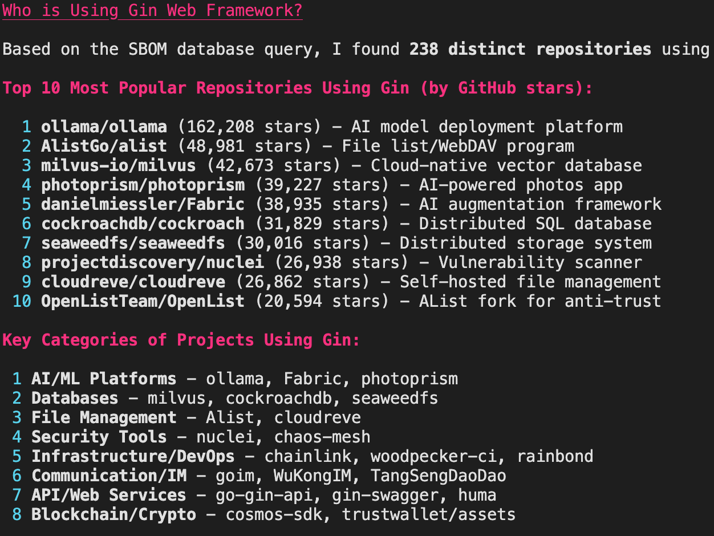
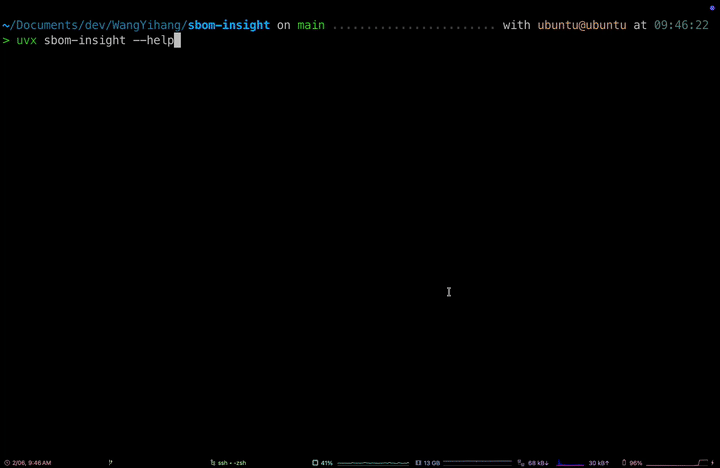
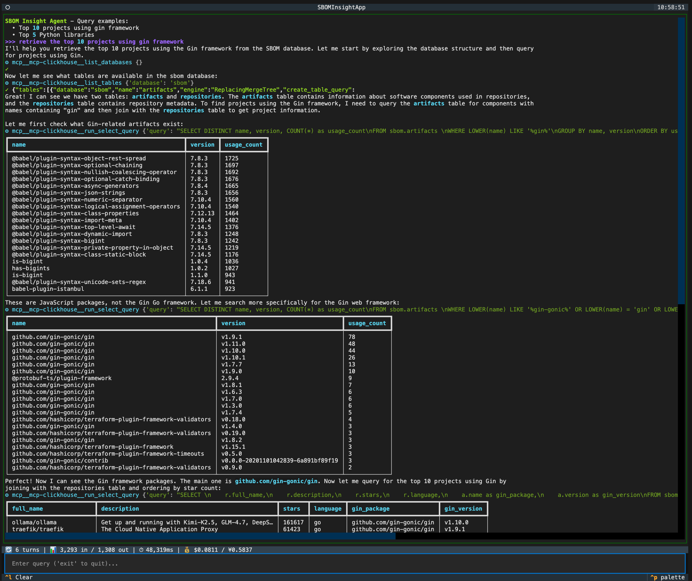
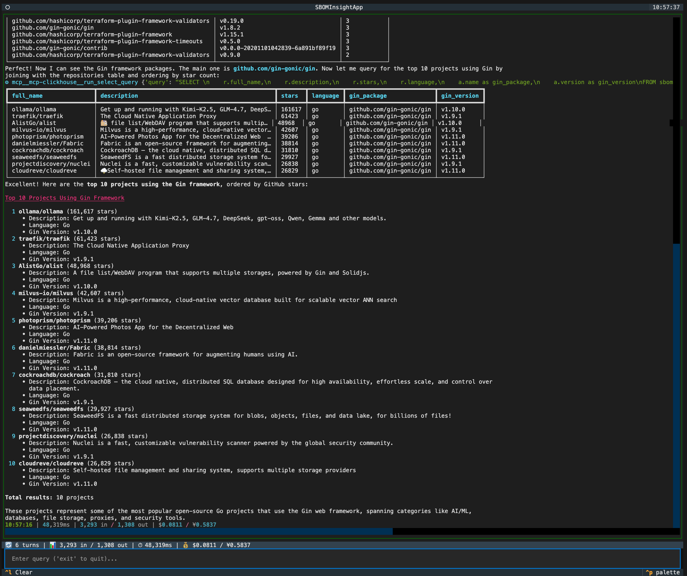

<h1 align="center">ChatSBOM</h1>

<p align="center">
  <strong>Talk to your Supply Chain. Chat with SBOMs.</strong>
</p>


ChatSBOM is a CLI tool for indexing and querying Software Bill of Materials (SBOM) data, providing deep insights into project dependencies.

<p align="center">
  
</p>

<p align="center">
  
</p>

## Features

- **Discover**: Find high-quality repositories on GitHub by stars and language.
- **Collect**: Enrich metadata and fetch dependency files (`go.mod`, `package.json`, etc.).
- **Generate**: Transform files into standard SBOM format using [Syft](https://github.com/anchore/syft).
- **Index**: Load SBOM data into [ClickHouse](https://clickhouse.com/) for high-performance queries.
- **Attribute**: Tell **direct** dependencies from **transitive** ones by parsing manifests.
- **Query**: Use the CLI for stats/searches to get insights into project dependencies.
- **Chat**: Use the AI-powered natural language chat to chat with SBOM data.
- **Publish**: Export to Parquet and serve an interactive dashboard from the edge.

## Getting Started

### 1. Prerequisites

- [Docker](https://www.docker.com/) (for ClickHouse)
- [Syft](https://github.com/anchore/syft) (for SBOM generation)
- [uv](https://github.com/astral-sh/uv) (for AI-powered chat feature)

### 2. Installation

```bash
# Via pip
pip install chatsbom

# Via pipx
pipx install chatsbom

# Or run directly via uvx
uvx chatsbom
```

### 3. Setup

#### Start Database

Option 1: Using docker compose

```bash
docker compose up -d
```

Option 2: Using docker run

```bash
docker run -d --name clickhouse -p 8123:8123 --ulimit nofile=262144:262144 clickhouse/clickhouse-server:25.12-alpine
docker exec clickhouse clickhouse-client -q "CREATE DATABASE IF NOT EXISTS chatsbom"
docker exec clickhouse clickhouse-client -q "CREATE USER IF NOT EXISTS admin IDENTIFIED BY 'admin'"
docker exec clickhouse clickhouse-client -q "GRANT ALL ON *.* TO admin WITH GRANT OPTION"
docker exec clickhouse clickhouse-client -q "CREATE USER IF NOT EXISTS guest IDENTIFIED BY 'guest'"
docker exec clickhouse clickhouse-client -q "GRANT SELECT ON chatsbom.* TO guest"
docker exec clickhouse clickhouse-client -q "ALTER USER guest SET PROFILE readonly"
```

#### Configure Environment: Set your API keys

```bash
export GITHUB_TOKEN="your_github_token"
export ANTHROPIC_AUTH_TOKEN="your_anthropic_token"
```

### 4. Basic Workflow

```bash
# 1. Search and collect data
chatsbom github search --language ruby --min-stars 1000
chatsbom github repo --language ruby
chatsbom github release --language ruby
chatsbom github commit --language ruby
chatsbom github content --language ruby

# 2. Generate and index SBOMs
chatsbom sbom generate --language ruby
chatsbom db index --language ruby

# 3. Query insights
chatsbom db status
chatsbom db query mail --direct-only
chatsbom chat
```

## Command Reference

### `chatsbom github` — collection

| Command | Purpose |
| --- | --- |
| `search` | Find repositories by language and star count |
| `repo` | Enrich each repository with full GitHub metadata |
| `release` | Collect releases and tags |
| `commit` | Resolve the commit SHA for each download target |
| `tree` | Fetch the file tree for a commit |
| `content` | Download the dependency manifests and lockfiles |
| `depgraph` | Download GitHub's own dependency graph as a second SBOM source |
| `readme` | Download README content |
| `classify` | Classify repositories and extract metadata using an LLM |

### `chatsbom sbom` — generation

| Command | Purpose |
| --- | --- |
| `generate` | Run Syft over the downloaded content to produce SBOMs |
| `lock` | Resolve a lockfile for projects that ship none, inside a container |

### `chatsbom db` — indexing and querying

| Command | Purpose |
| --- | --- |
| `index` | Load repositories, releases and SBOM artifacts into ClickHouse |
| `status` | Row counts, per-language totals, framework adoption |
| `query` | Find the repositories that depend on a package |
| `export` | Export projects and their detected frameworks to CSV |

`db query` takes `--direct-only` to restrict results to repositories that
declare the package in their own manifest, rather than inheriting it
through another dependency.

### `chatsbom export` — portable artefacts

| Command | Purpose |
| --- | --- |
| `parquet` | Write the dataset as Parquet plus a checksummed manifest |
| `schema` | Emit the export contract as JSON and/or TypeScript types |

The whole dependency graph — 6.1M rows across 28k repositories —
compresses to roughly 19 MB of Parquet, small enough to query in a
browser. `web/` is a Cloudflare Worker that serves a dashboard doing
exactly that, with no query backend; see `web/README.md`.

`export schema` is the seam between the two languages. `src/schema.ts` in
the web project is generated from `chatsbom/export/schema.py`, so a
renamed column is a TypeScript compile error rather than an `undefined`
at runtime — and a test fails if the checked-in copy goes stale.

### `chatsbom openapi` — OpenAPI specification analysis

| Command | Purpose |
| --- | --- |
| `candidates` | Find repositories that ship an OpenAPI specification |
| `clone` | Clone candidate repositories for version-by-version analysis |
| `list-paths` | Export the API paths declared in each specification |
| `drift` | Measure how API paths change across releases |
| `plot-drift` | Render the drift data as a figure |
| `stats` | Summarise specification counts and sizes |

### `chatsbom chat` — AI querying

Starts a terminal UI that answers natural-language questions by querying
ClickHouse. Requires `ANTHROPIC_API_KEY` or `ANTHROPIC_AUTH_TOKEN`.

## Direct vs Transitive Dependencies

Syft reads lockfiles, so an SBOM is the *resolved closure* of a project's
dependencies. Of the 118 Ruby repositories in our dataset whose SBOM lists
`mail`, only 17 actually declare it — the rest inherit it through
`actionmailer` or `devise`.

ChatSBOM parses the manifests alongside the lockfiles and records how each
dependency arrived:

| Value | Meaning |
| --- | --- |
| `direct` | The project's own manifest declares the package |
| `transitive` | Another dependency pulled it in |
| `unknown` | No manifest could be read, so the question is unanswered |

Supported manifests: `Gemfile`/`*.gemspec`, `package.json`, `go.mod` (honouring
`// indirect`), `Cargo.toml`, `pyproject.toml`/`requirements*.txt`,
`composer.json`, `pom.xml`/`build.gradle`.

### Two SBOM sources

Syft only sees what a lockfile tells it, which is why Maven and Composer
projects come back nearly empty. `github depgraph` adds GitHub's own
dependency graph, which parses manifests server-side:

| Repository | Syft | Dependency graph |
| --- | --- | --- |
| `spring-projects/spring-boot` | 0 | 303 |
| `elastic/elasticsearch` | 0 | 107 |
| `NationalSecurityAgency/ghidra` | 0 | 147 |

The two are complementary, not interchangeable, so every artifact row
records which produced it:

| Column | Meaning |
| --- | --- |
| `source` | `syft` (lockfile, resolved closure) or `github-depgraph` (manifest, declared only) |
| `version_kind` | `resolved` (exact), `constraint` (`>= 0`, `^4.18`) or `unversioned` |

GitHub's graph is flat — the repository `DEPENDS_ON` each package with no
tree — so its rows are always `direct`. Its versions are the manifest's
constraints, which `version_kind` marks so a range is never charted as if
it were a resolution.

`repositories.manifest_sources` records which manifest files were read, so
a `transitive` verdict can be told apart from an unexamined one.

### Resolving missing lockfiles

`sbom lock` closes the remaining gap: where a project ships no lockfile,
it runs the ecosystem's own resolver to produce one, which `sbom generate`
then folds into the scan.

Resolving dependencies means **executing project-controlled code** — a
`Gemfile` is Ruby evaluated on load, a POM runs whatever build plugins it
declares, `composer` runs `scripts` hooks. Doing that on the host across
thousands of unvetted repositories is not acceptable, so every resolution
runs in a container with:

- the project mounted **read-only**, and exactly one writable path (the
  output directory) — no other host path is visible
- `--user` set to the invoking user, never root: root in the container is
  root on a bind mount
- `--cap-drop ALL`, `--security-opt no-new-privileges`, `--read-only`
  root filesystem with a `tmpfs` scratch
- bounded memory, CPU, process count and wall-clock time
- images pinned to explicit versions, so generated lockfiles are
  reproducible

Network access is the one thing that cannot be removed — resolution *is*
fetching metadata from a registry. That is the residual risk, and it is
why nothing else is granted. Requires Docker.

Recipes exist for Java, PHP, Ruby and Python. Go, Rust and npm are absent
on purpose: those ecosystems commit lockfiles as a matter of course, so
Syft already reads them (Go coverage is 90%, Rust 69%).

## Development

```bash
uv sync
uv run pytest                  # unit tests
docker compose up -d           # start ClickHouse for integration tests
uv run pytest                  # now includes the query-layer integration tests
uv run pre-commit run -a       # lint, format, type-check
```

Query-layer tests run against a real ClickHouse and are skipped when one is
not reachable on `localhost:8123`.

### Database accounts

`docker compose` creates two accounts. `admin` owns the schema and is used
by `db index`; `guest` is read-only and is what `db query`, `db status`,
`db export` and `chat` connect as.

The `guest` profile bounds query *cost*, not just privileges — execution
time, memory, rows read and result size — because `readonly` alone does not
stop one expensive join from exhausting the server. See
`database/config/users.d/guest.xml`.

Grants for `guest` live in that same file: a user defined in `users.xml`
is read-only storage, so `GRANT` at runtime fails with
`ACCESS_STORAGE_READONLY`. Pointing `CLICKHOUSE_DB` at a different
database means adding a matching `<query>GRANT SELECT ON ...</query>`
line there.

The committed passwords are development defaults. For any deployment
reachable from outside localhost, replace `<password>` with
`<password_sha256_hex>` and supply `CLICKHOUSE_ADMIN_PASSWORD` /
`CLICKHOUSE_GUEST_PASSWORD` from the environment.

## Use Case: Analyzing Framework Adoption

Find the most popular projects depending on a specific library (e.g., `gin`) using natural language.

<p align="center">
  
</p>

<p align="center">
  
</p>
